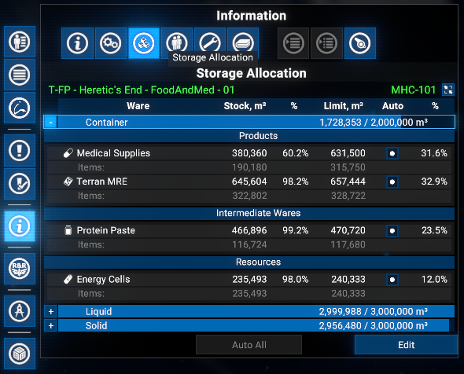
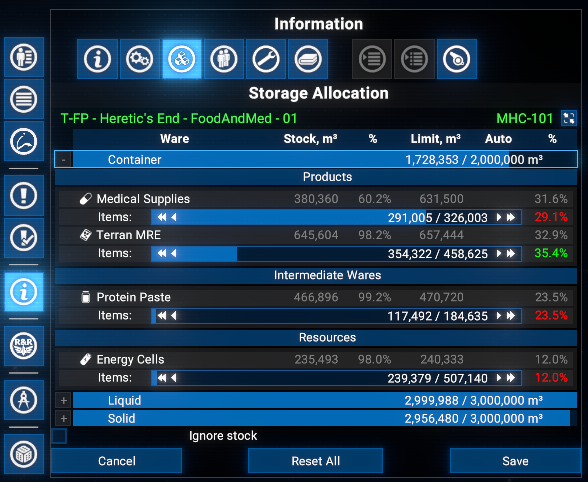
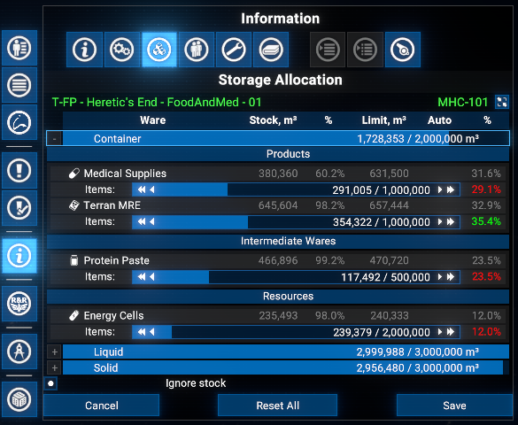
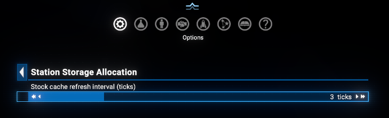

# Station Storage Allocation

Adds a **Storage Allocation** tab to the info panel tab strip in the map menu for player-owned stations. Shows storage capacity and usage per type with expandable per-ware allocation and lets you adjust per-ware storage limits without leaving the map.

## Features

- **Storage Allocation tab**: Dedicated tab in the station info panel showing a read-only capacity bar per storage type (solid, container, liquid, etc.).
- **Expandable storage types**: Click the `+` button on any type row to expand it and see all wares stored in that type.
- **Per-ware view**: Each ware row shows current stock (m³ and %), the active limit (m³ and %), and an **Auto** checkbox. Toggling the checkbox immediately switches between auto-managed and manually pinned limits without entering edit mode.
- **Auto All button**: When viewing an expanded type, a single button clears all manual overrides for that type at once, restoring auto management.
- **Edit mode**: Click **Edit** (requires an expanded type) to enter edit mode. The game pauses automatically. Each ware gets an allocation slider to adjust its limit. Changes are previewed live and are only applied on **Save**.
- **Rebalancing**: When a slider is moved, the limits of other wares are proportionally reduced to keep the total within the type's capacity.
- **Ignore stock checkbox**: Allows setting a limit below the current stock (useful for planned reductions).
- **Ware groups**: Wares are split into **Products**, **Intermediates**, **Resources**, and **Trade Wares** based on production and consumption at the station.
- **Configurable stock refresh**: Slider in **Extension options** sets how often the stock cache is refreshed during view mode (default: every 3 UI ticks).

## Requirements

- **X4: Foundations**: Version **8.00HF4** or higher and **UI Extensions and HUD**: Version **v8.0.4.3** or higher by [kuertee](https://next.nexusmods.com/profile/kuertee?gameId=2659).
  - Available on Nexus Mods: [UI Extensions and HUD](https://www.nexusmods.com/x4foundations/mods/552)
- **X4: Foundations**: Version **9.00 beta 3** or higher and **UI Extensions and HUD**: Version **v9.0.0.0.3** or higher by [kuertee](https://next.nexusmods.com/profile/kuertee?gameId=2659).
  - Available on Nexus Mods: [UI Extensions and HUD](https://www.nexusmods.com/x4foundations/mods/552)
- **Mod Support APIs**: Version 1.95 or higher by [SirNukes](https://next.nexusmods.com/profile/sirnukes?gameId=2659).
  - Available on Steam: [SirNukes Mod Support APIs](https://steamcommunity.com/sharedfiles/filedetails/?id=2042901274)
  - Available on Nexus Mods: [Mod Support APIs](https://www.nexusmods.com/x4foundations/mods/503)

## Installation

- **Steam Workshop**: [Station Storage Allocation](https://steamcommunity.com/sharedfiles/filedetails/?id=0) - only for **Game version 8.00** with latest Steam version of the `UI Extensions and HUD` mod (version 80.43 from April 8).
- **Nexus Mods**: [Station Storage Allocation](https://www.nexusmods.com/x4foundations/mods/2075)

## Usage

Open the map, select a player-owned station, and click the **Storage Allocation** tab in the info panel.

### Viewing allocation

Each storage type row shows a capacity bar with the type name, total space used, and total capacity.

Click `+` to expand a type and see per-ware rows:

- **Stock m³ / %**: current stock and its share of the limit.
- **Limit m³ / %**: active limit and its share of the type's total capacity.
- **Auto checkbox**: checked = game manages the limit automatically; unchecked = manually pinned. Click directly to toggle without entering edit mode.

The **Auto All** button (bottom-left, view mode) clears all manual overrides for the currently expanded type in one click. It is only enabled when at least one ware has a manual override.

### Edit mode

Click **Edit** to enter edit mode (game pauses).

A slider appears for each ware in the expanded type. Slide to adjust the allocation - other wares adjust proportionally to stay within capacity. The saved (game) limit is shown greyed-out above the slider for reference.

- **Ignore stock**: enables setting a limit below current stock. Auto-enabled when any ware's saved limit is already below its stock.

- **Reset All**: removes all manual overrides on the station, restoring fully auto-managed limits.
- **Save**: applies all slider values and exits edit mode (game resumes).
- **Cancel**: discards all changes and exits edit mode (game resumes).

### Extension options

**Options Menu > Extension options > Station Storage Allocation**:

- **Stock cache refresh interval** (1-10, default 3): UI ticks before stock values are re-read from the game. Lower = more up-to-date, higher = less CPU usage.

## Credits

- **Author**: Chem O`Dun, on [Nexus Mods](https://next.nexusmods.com/profile/ChemODun/mods?gameId=2659) and [Steam Workshop](https://steamcommunity.com/id/chemodun/myworkshopfiles/?appid=392160)
- *"X4: Foundations"* is a trademark of [Egosoft](https://www.egosoft.com).

## Acknowledgements

- [EGOSOFT](https://www.egosoft.com) - for the X series.
- [kuertee](https://next.nexusmods.com/profile/kuertee?gameId=2659) - for the `UI Extensions and HUD` that makes this extension possible.
- [SirNukes](https://next.nexusmods.com/profile/sirnukes?gameId=2659) - for the `Mod Support APIs` that power the options menu.

## Changelog

### [9.00.01] - 2026-04-20

- Initial release.
