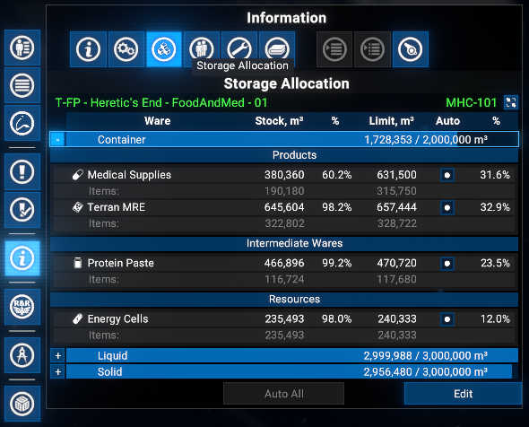
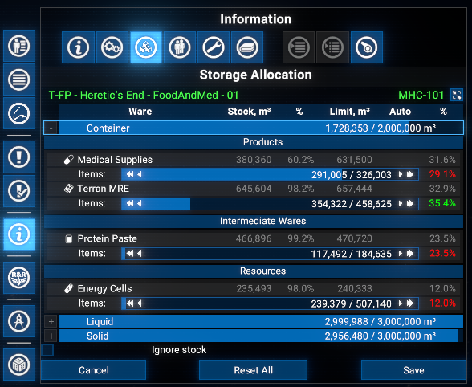
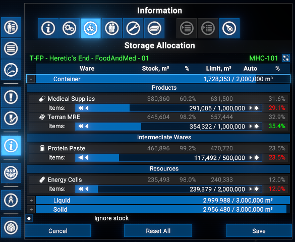
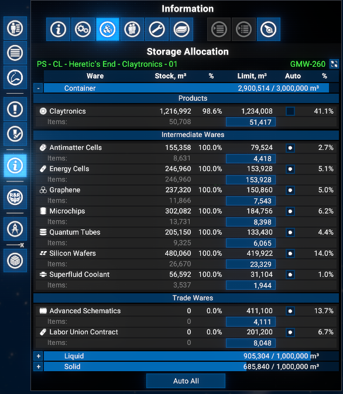
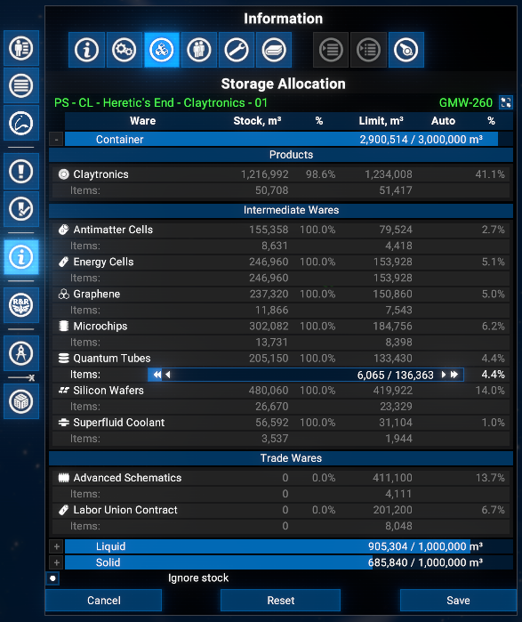
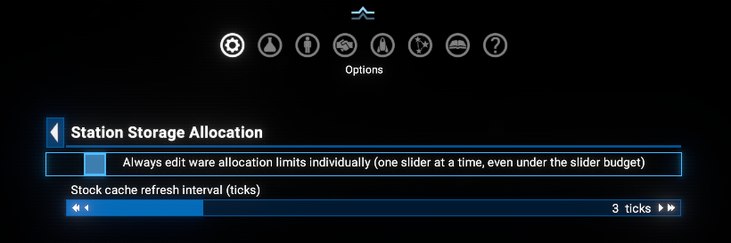

# Station Storage Allocation

Adds a **Storage Allocation** tab to the info panel tab strip in the map menu for player-owned stations. Shows storage capacity and usage per type with expandable per-ware allocation and lets you adjust per-ware storage limits without leaving the map.

## Features

- **Storage Allocation tab**: Dedicated tab in the station info panel showing a read-only capacity bar per storage type (solid, container, liquid, etc.).
- **Expandable storage types**: Click the `+` button on any type row to expand it and see all wares stored in that type.
- **Per-ware view**: Each ware row shows current stock (m³ and %), the active limit (m³ and %), and an **Auto** checkbox. Toggling the checkbox immediately switches between auto-managed and manually pinned limits without entering edit mode.
- **Auto All button**: When viewing an expanded type, a single button clears all manual overrides for that type at once, restoring auto management.
- **Edit mode**: Click **Edit** (requires an expanded type) to enter edit mode. The game pauses automatically. Each ware gets an allocation slider to adjust its limit. Changes are previewed live and are only applied on **Save**.
- **Single-ware edit mode**: For stations with too many wares under one type to give each one its own slider at once (a hard engine limit), or when enabled for all types via Extension options, the **Edit** button is replaced by per-ware editing: click a ware's item-limit value to open a slider for just that ware, leaving every other ware untouched until you Save or Cancel.
- **Rebalancing**: When a slider is moved, the limits of other wares are proportionally reduced to keep the total within the type's capacity.
- **Ignore stock checkbox**: Allows setting a limit below the current stock (useful for planned reductions).
- **Ware groups**: Wares are split into **Products**, **Intermediates**, **Resources**, and **Trade Wares** based on production and consumption at the station.
- **Configurable stock refresh**: Slider in **Extension options** sets how often the stock cache is refreshed during view mode (default: every 3 UI ticks).

## Requirements

- **X4: Foundations**: Version **8.00HF4** or higher and **UI Extensions and HUD**: Version **v8.0.4.3** or higher by [kuertee](https://next.nexusmods.com/profile/kuertee?gameId=2659).
  - Available on Nexus Mods: [UI Extensions and HUD](https://www.nexusmods.com/x4foundations/mods/552)
- **X4: Foundations**: Version **9.00** or higher and **UI Extensions and HUD**: Version **v9.0.0.5** or higher by [kuertee](https://next.nexusmods.com/profile/kuertee?gameId=2659).
  - Available on Nexus Mods: [UI Extensions and HUD](https://www.nexusmods.com/x4foundations/mods/552)
- **Mod Support APIs**: Version 1.95 or higher by [SirNukes](https://next.nexusmods.com/profile/sirnukes?gameId=2659).
  - Available on Steam: [SirNukes Mod Support APIs](https://steamcommunity.com/sharedfiles/filedetails/?id=2042901274)
  - Available on Nexus Mods: [Mod Support APIs](https://www.nexusmods.com/x4foundations/mods/503)

## Installation

- **Steam Workshop**: [Station Storage Allocation](https://steamcommunity.com/sharedfiles/filedetails/?id=3710920643) - only for **Game version 9.00** with latest Steam version of the `UI Extensions and HUD` mod.
- **Nexus Mods**: [Station Storage Allocation](https://www.nexusmods.com/x4foundations/mods/2075)

## Usage

Open the map, select a player-owned station, and click the **Storage Allocation** tab in the info panel.

### Viewing allocation

Each storage type row shows a capacity bar with the type name, total space used, and total capacity.

Click `+` to expand a type and see per-ware rows:

- **Stock m³ / %**: current stock and its share of the limit.
- **Limit m³ / %**: active limit and its share of the type's total capacity.
- **Auto checkbox**: checked = game manages the limit automatically; unchecked = manually pinned. Click directly to toggle without entering edit mode.

The **Auto All** button (bottom-left, view mode) clears all manual overrides for the currently expanded type in one click. It is only enabled when at least one ware has a manual override.

### Edit mode

Click **Edit** to enter edit mode (game pauses).

A slider appears for each ware in the expanded type. Slide to adjust the allocation - other wares adjust proportionally to stay within capacity. The saved (game) limit is shown greyed-out above the slider for reference.

- **Ignore stock**: enables setting a limit below current stock. Auto-enabled when any ware's saved limit is already below its stock.

- **Reset All**: removes all manual overrides on the station, restoring fully auto-managed limits.
- **Save**: applies all slider values and exits edit mode (game resumes).
- **Cancel**: discards all changes and exits edit mode (game resumes).

### Single-ware edit mode

Some stations can hold more wares under one type than the game's slider-widget engine limit allows to display at once. For those types (and for every type, if you've enabled **Always edit ware allocation individually** in Extension options), the **Edit** button is hidden entirely - editing works one ware at a time instead:

- In the normal (view) state, each ware's item-count limit - the small dimmed number under **Items:** - becomes a clickable button.

  
- Clicking it pauses the game and opens a slider for **that ware only**. Every other ware in the type stays read-only; there's no way to switch to a different ware mid-session.

  

- The bottom bar shows **Cancel** / **Reset** / **Save**, same as normal edit mode, except **Reset** only clears the override for the ware currently being edited - not the whole station.
- To edit a different ware, **Save** or **Cancel** first, then click that ware's item-limit value.

### Extension options

**Options Menu > Extension options > Station Storage Allocation**:

- **Always edit ware allocation limits individually** (default: off): Forces single-ware edit mode for every storage type - even ones with few enough wares to normally use the all-at-once slider view.
- **Stock cache refresh interval** (1-10, default 3): UI ticks before stock values are re-read from the game. Lower = more up-to-date, higher = less CPU usage.

## Credits

- **Author**: Chem O`Dun, on [Nexus Mods](https://next.nexusmods.com/profile/ChemODun/mods?gameId=2659) and [Steam Workshop](https://steamcommunity.com/id/chemodun/myworkshopfiles/?appid=392160)
- *"X4: Foundations"* is a trademark of [Egosoft](https://www.egosoft.com).

## Acknowledgements

- [EGOSOFT](https://www.egosoft.com) - for the X series.
- [kuertee](https://next.nexusmods.com/profile/kuertee?gameId=2659) - for the `UI Extensions and HUD` that makes this extension possible.
- [SirNukes](https://next.nexusmods.com/profile/sirnukes?gameId=2659) - for the `Mod Support APIs` that power the options menu.

## Changelog

### [9.00.07] - 2026-08-13

- **Fixed**
  - Fixed missed text items.

### [9.00.06] - 2026-07-26

- **Fixed**
  - Issues in some high-resolution modes (upper then 1080p) with high UI Scale levels.
  - Issue with reaching the limit of the game's slider-widget engine when editing a type with too many wares to show at once.
- **Added**
  - Option to always edit ware allocation limits individually, even for types with few enough wares to normally use the all-at-once slider view.

### [9.00.05] - 2026-06-27

- **Changed**
  - On Steam: restricted to game version 9.0 or higher

### [9.00.03] - 2026-04-24

- **Fixed**
  - Issues in high-resolution modes (upper then 1080p)

### [9.00.02] - 2026-04-22

- **Fixed**:
  - Some zero count wares were not shown in lists.

### [9.00.01] - 2026-04-20

- Initial release.
